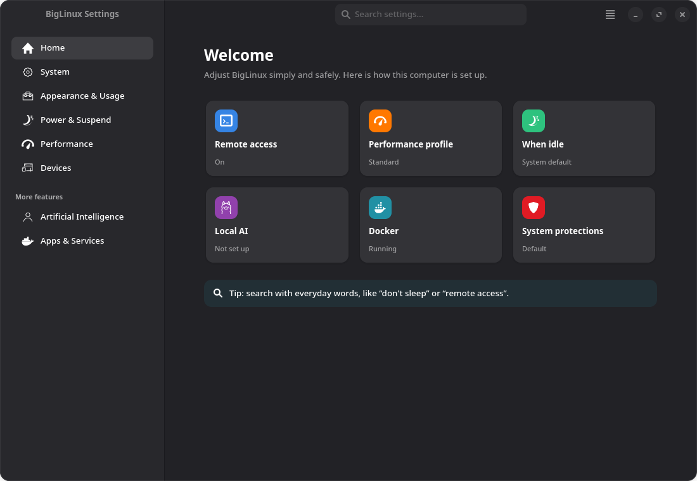
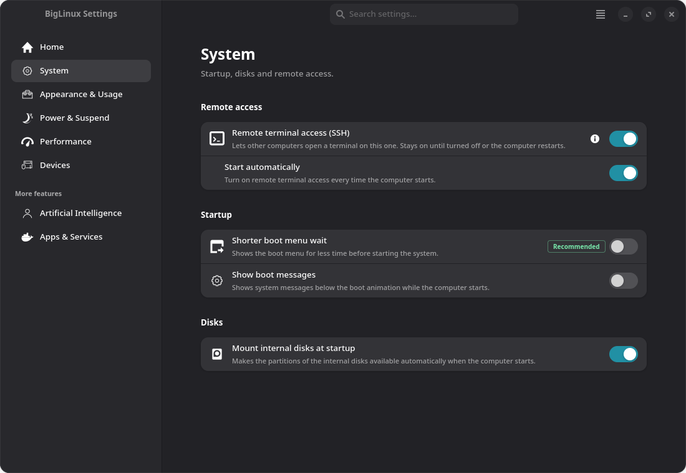
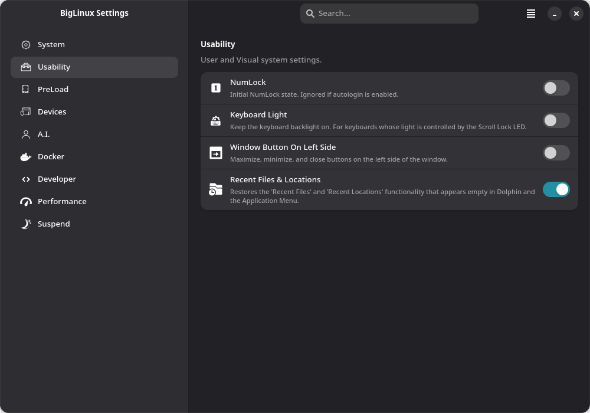
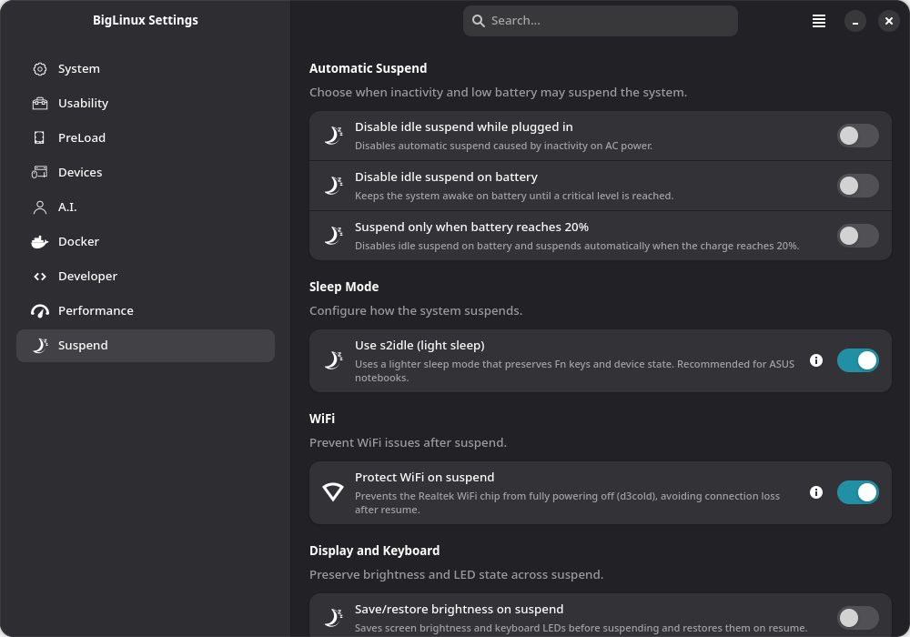
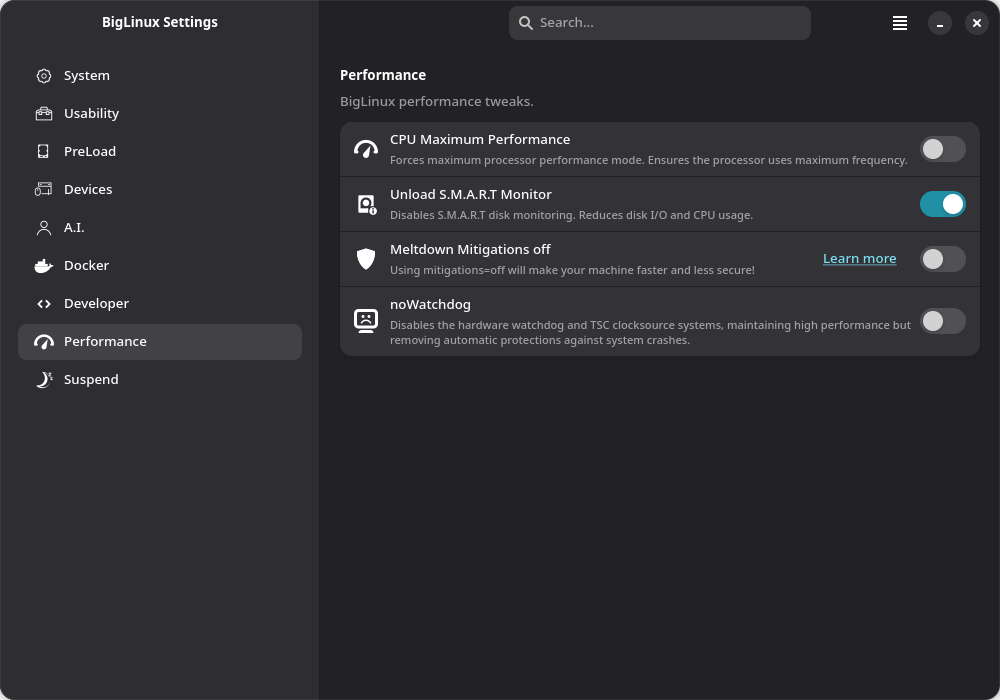
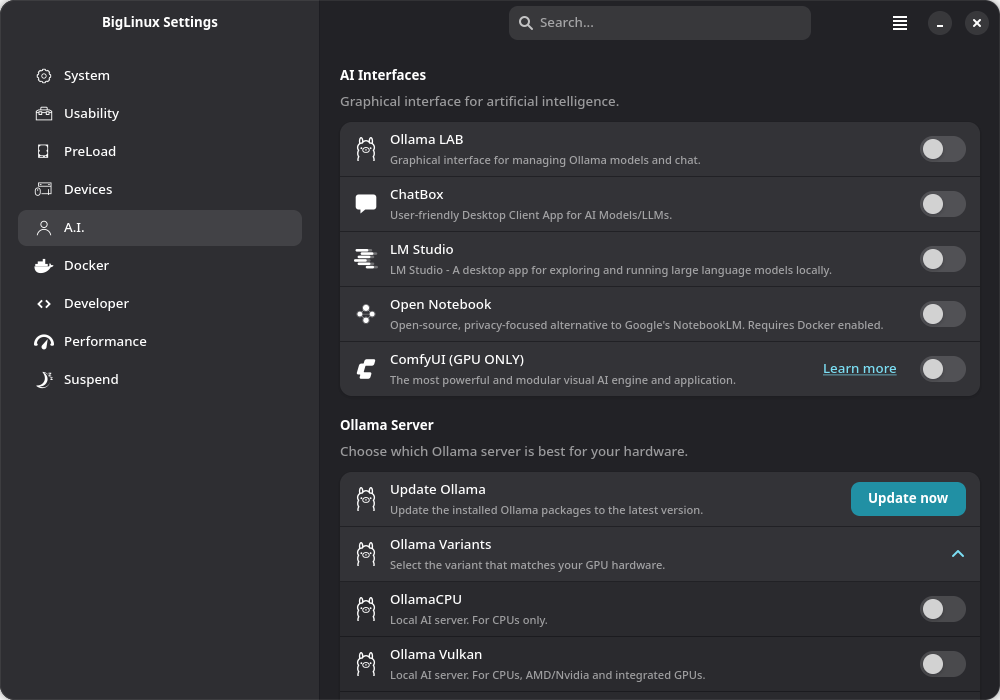
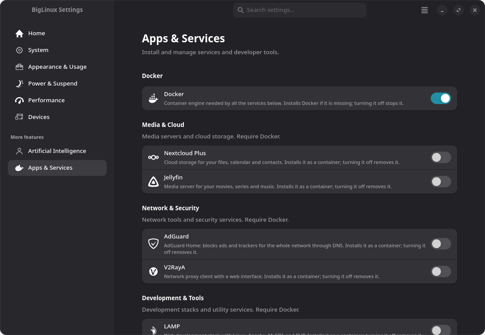
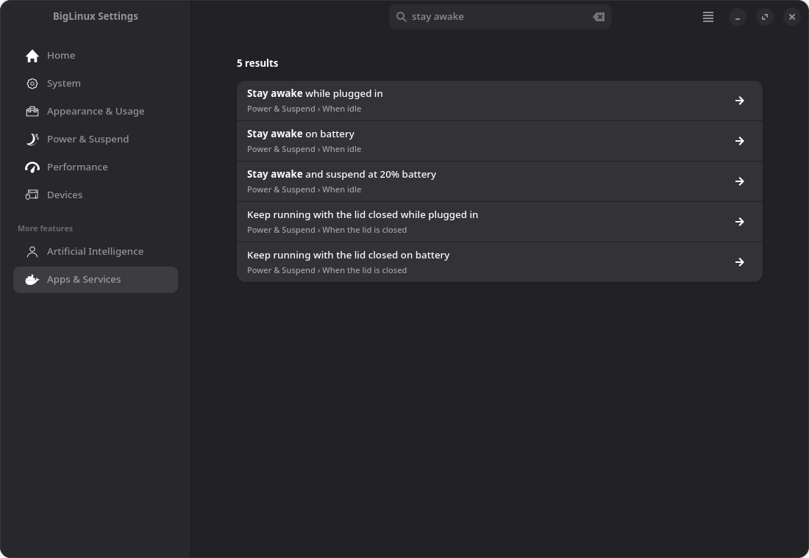

<div align="center">


# BigLinux Settings

**One place to tune BigLinux and BigCommunity: system, desktop, power, performance, devices, AI and services — with the consequences explained before you change anything.**

[](https://github.com/big-comm/big-system-config/actions/workflows/validate.yml)
[](https://sonarcloud.io/summary/new_code?id=big-comm_biglinux-settings)
[](https://github.com/big-comm/big-system-config/releases)
[](LICENSE)




</div>

---

## Table of contents

- [Overview](#overview)
- [Features](#features)
- [Screenshots](#screenshots)
- [Supported desktops](#supported-desktops)
- [Installation](#installation)
- [Usage](#usage)
- [How it works](#how-it-works)
- [Project layout](#project-layout)
- [Development](#development)
- [Translations](#translations)
- [Contributing](#contributing)
- [License](#license)

## Overview

BigLinux Settings is a GTK 4 / libadwaita application that gathers the tweaks
BigLinux and BigCommunity users most often need, and turns each of them into a
single switch. Every switch reads the **real state of the system** when the
page opens, applies the change in the background with progress feedback, and
verifies the result before confirming it.

Highlights:

- **Home overview** — cards show the real state of key areas (remote access,
  performance profile, idle policy, local AI, Docker, system protections) and
  open the exact setting.
- **Consequences first** — every option says what it does, what it installs or
  removes, and when it takes effect, *before* you switch it.
- **Honest switches** — the state shown is read from the system, never cached;
  a failed change is reverted and reported. A setting that cannot be checked
  says so and offers *Try again*, instead of disappearing.
- **Undo window** — non-destructive changes wait a moment before applying, with
  an *Undo* button.
- **Search that understands people** — accent-insensitive, with everyday
  aliases (“don't sleep”, “remote access”); each result shows where it lives
  (*Page › Section*) and opens, scrolls to and highlights the exact setting.
- **Adaptive layout** — resizable window; the sidebar collapses on narrow
  screens and the settings column stays readable on wide ones.
- **Safe privileges** — only the steps that need root go through `pkexec`, with
  validated arguments.
- **Desktop aware** — options that do not apply to the current desktop are
  hidden instead of failing.
- **Accessible** — keyboard navigation and screen-reader labels throughout.

## Features

| Page | What you can do |
|---|---|
| **Home** | Overview cards with the live state of remote access, performance profile, idle policy, local AI, Docker and system protections. |
| **System** | Remote terminal access (SSH) now and at startup, shorter boot menu wait, boot messages under the splash, mount internal disks at startup. |
| **Appearance & Usage** | Numeric keypad at login, keyboard light (Scroll Lock LED keyboards), window buttons on the left, KZones window snapping (KDE), recent files and folders. |
| **Power & Suspend** | *When idle*: stay awake on AC or battery, or suspend at 20 % battery. *When the lid is closed*: keep running on AC and/or battery. *Fix problems after resume*: s2idle light sleep, Realtek Wi-Fi fix, brightness restore, GNOME extension recovery. |
| **Performance** | Performance power profile, visual effects, file indexing, application launch (preload Firefox, Brave, Chrome, Chromium, LibreWolf, Pale Moon, Opera, Vivaldi, GNOME Web, LibreOffice), and — under *Protections and diagnostics*, with explicit confirmation — disk health monitoring, CPU vulnerability mitigations and lockup detectors. |
| **Devices** | Wi-Fi and Bluetooth, JamesDSP audio effects, natural scrolling, and connect/disconnect each network interface. |
| **Artificial Intelligence** | Ollama engines (CPU, Vulkan, NVIDIA CUDA, AMD ROCm) with optional LAN sharing, Ollama LAB, ChatAI, ChatBox, LM Studio, Open Notebook and ComfyUI. |
| **Apps & Services** | Docker engine and ready-made services grouped by purpose — Nextcloud Plus, Jellyfin, AdGuard, V2RayA, LAMP, SWS, Portainer Client, Open Notebook — plus developer tools (OpenClaude). |

## Screenshots

<table>
  <tr>
    <td align="center"><br><sub><b>System</b></sub></td>
    <td align="center"><br><sub><b>Appearance & Usage</b></sub></td>
  </tr>
  <tr>
    <td align="center"><br><sub><b>Power & Suspend</b></sub></td>
    <td align="center"><br><sub><b>Performance</b></sub></td>
  </tr>
  <tr>
    <td align="center"><br><sub><b>Artificial Intelligence</b></sub></td>
    <td align="center"><br><sub><b>Apps & Services</b></sub></td>
  </tr>
  <tr>
    <td align="center"><br><sub><b>Search — Page › Section paths</b></sub></td>
  </tr>
</table>

## Supported desktops

The application runs on any desktop; each option declares where it applies and
is hidden elsewhere.

| Desktop | Session | Notes |
|---|---|---|
| KDE Plasma 6 | Wayland, X11 | Full support, including KWin effects, KZones, Baloo and Dolphin integration. |
| GNOME | Wayland, X11 | Full support, including the GNOME Shell extension health monitor. |
| XFCE | X11 | Supported options: NumLock, window buttons, idle suspend and lid policies. |
| Cinnamon | X11 | Supported options: NumLock, window buttons, recent files, idle suspend and lid policies. |

System-level options (SSH, GRUB, Docker, AI, suspend hooks, keyboard light, …)
work regardless of the desktop.

## Installation

### BigLinux / BigCommunity

BigLinux Settings ships with the distribution in the `big-system-config`
package (formerly `biglinux-settings`). To install or update it:

```bash
sudo pacman -Syu big-system-config
```

The launcher command stays `biglinux-settings`.

### Build the package

```bash
git clone https://github.com/big-comm/big-system-config.git
cd big-system-config/pkgbuild
makepkg -si
```

The package `check()` step runs the full validation suite (tests, linters and
translation catalog checks) before packaging.

**Runtime dependencies:** `gtk4`, `libadwaita`, `python`, `python-gobject`,
`polkit`, `networkmanager`, `systemd`, `util-linux`.
Optional integrations (KDE `kconfig`, `qt6-tools`, `power-profiles-daemon`,
`upower`, `numlockx`, `grub`, `plymouth`, …) are listed in
[`pkgbuild/PKGBUILD`](pkgbuild/PKGBUILD).

## Usage

Open **BigLinux Settings** from the application menu, or run:

```bash
biglinux-settings
```

- The app opens on **Home**, an overview of how the computer is set up; click
  a card to go straight to that setting.
- Pick a page in the sidebar and flip a switch. A short banner lets you
  **undo** before the change is applied.
- Type in the search field with everyday words (“don't sleep”, “battery”,
  “remote access”); accents and case do not matter. Opening a result scrolls to
  and highlights the setting, and the ← button brings you back to the results.
- Options marked **Recommended** are safe defaults; options with an ⓘ icon
  show extra details (addresses, requirements) when enabled.
- Changes that affect boot or system security ask for confirmation first.

## How it works

Each switch is backed by a small shell script that follows one contract:

```text
<group>/<name>.sh check            → prints true | false | true_disabled | unsupported
<group>/<name>.sh toggle true|false → applies the change; exit 0 only on success
```

- `check` runs in parallel worker threads when a page is first shown, so the UI
  never blocks; `unsupported` hides the option on the current desktop.
- `toggle` runs in the background with a spinner. On success the page re-reads
  the real state; on failure the switch reverts and a message explains it.
- Steps that need root live in `<name>Run.sh` helpers called through `pkexec`.
  They validate every argument and never trust paths from the caller.
- System changes are applied atomically where possible (temporary file + move)
  and rolled back when a later step fails — for example, `/etc/default/grub` is
  restored if `grub.cfg` cannot be regenerated.

The suspend subsystem has two parts: a root **systemd sleep hook**
(`/usr/lib/systemd/system-sleep/biglinux-sleep`) for hardware state such as
brightness, LEDs and Wi-Fi, configured in `/etc/biglinux/sleep.conf`; and a
**user service** (`biglinux-sleep-monitor`) that keeps GNOME Shell extensions
healthy across suspend.

## Project layout

```text
usr/
├── bin/biglinux-settings                    # launcher
├── share/biglinux/biglinux-settings/
│   ├── main.py                              # window, adaptive sidebar, search, navigation
│   ├── base_page.py                         # rows, check/toggle engine, undo, sync, search metadata
│   ├── home_page.py                         # Home overview cards
│   ├── *_page.py                            # one module per sidebar page
│   ├── system/ usability/ preload/ devices/ # check/toggle scripts (grouped by area)
│   ├── ai/ docker/ developer/ performance/
│   ├── sleep/                               # suspend scripts and policy helpers
│   ├── icons/                               # symbolic icons
│   └── styles.css
├── lib/biglinux/sleep/                      # sleep hook, handlers and GNOME monitor
├── lib/systemd/                             # system-sleep hook and user service
└── share/locale/                            # compiled translations (.mo)
etc/biglinux/sleep.conf                      # sleep handler configuration
locale/                                      # translation sources (.pot/.po)
tests/                                       # pytest suite
pkgbuild/PKGBUILD                            # Arch package recipe
```

## Development

Run the application straight from the repository:

```bash
./usr/bin/biglinux-settings
```

The launcher prefers the local tree when it exists. Privileged helpers are
invoked by their installed path (`/usr/share/biglinux/biglinux-settings/...`),
so install the package once to exercise options that need root.

### Tests and checks

```bash
python -m pip install --require-hashes --only-binary :all: -r requirements-dev.txt

pytest -q
ruff check usr tests locale/normalize-po-header.py
find usr/share/biglinux/biglinux-settings locale -name '*.sh' -print0 | xargs -0 shellcheck --severity=warning
find usr/share/biglinux/biglinux-settings locale -name '*.sh' -print0 | xargs -0 -n1 bash -n
```

The test suite runs the real shell scripts inside a sandbox: desktop and system
tools (`kwriteconfig6`, `qdbus6`, `gsettings`, `xfconf-query`, `pacman`,
`pkexec`, `systemctl`, …) are replaced by fakes on `PATH`, `HOME` points to a
temporary directory, and sysfs/`/etc` paths are redirected to fixtures. Nothing
on the host is modified. Test-only path overrides are ignored when a script
runs as root.

The same checks run in CI on every push and pull request
([`validate.yml`](.github/workflows/validate.yml)), and the code is analysed by
[SonarQube Cloud](https://sonarcloud.io/summary/new_code?id=big-comm_biglinux-settings).

Development dependencies are pinned with hashes. To update them, edit
`requirements-dev.in` and regenerate the lock file:

```bash
uv pip compile requirements-dev.in --generate-hashes --universal \
  --python-version 3.13 -o requirements-dev.txt
```

### Adding a new option

1. Create `<group>/<name>.sh` implementing `check` and `toggle` (see
   [How it works](#how-it-works)); put root-only steps in `<name>Run.sh` and
   call it with `pkexec`.
2. Add a row in the page module with `self.create_row(group, _("Title"),
   _("What it does and its consequence"), "<name>", "<icon>-symbolic",
   keywords=[_("everyday alias")])`. Use `inverted=True` to present a
   "disable X" script with a positive label, and `applies_after_restart=True`
   for boot-time changes.
3. Add a symbolic icon to `icons/` if needed.
4. Add tests in `tests/` that run the script against fake tools.

## Translations

The interface is translated into **29 languages**. Translation sources live in
[`locale/`](locale) and compiled catalogs in `usr/share/locale/`.

After changing user-visible strings, refresh the catalogs:

```bash
locale/update-translations.sh
```

This regenerates `biglinux-settings.pot`, merges every `.po` file and compiles
the `.mo` files. New strings are also translated automatically by the
organization's translation workflow.

## Contributing

Bug reports, ideas and pull requests are welcome.

1. Fork the repository and create a branch from `main`.
2. Keep each switch honest: `check` must report what `toggle` applied.
3. Run the tests and linters above before opening the pull request.
4. Describe what changed and on which desktop/session you tested it.

Report issues at
[github.com/big-comm/big-system-config/issues](https://github.com/big-comm/big-system-config/issues).

## License

BigLinux Settings is free software, released under the
[GNU General Public License v3.0 or later](LICENSE).

<div align="center">
<sub>Made with ❤️ by the <a href="https://www.biglinux.com.br">BigLinux</a> and BigCommunity contributors.</sub>
</div>
